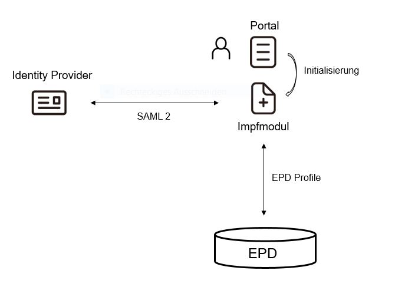

## Scope des Impfmoduls

### Überblick
eHealth Suisse verfolgt das Ziel, in 2023 einen elektronischen Impfausweis für alle
Einwohner der Schweiz auf der Basis des elektronischen Patientendossiers (EPD)
einzuführen.

Die verteilte Architektur des EPD und die Rechtsgrundlagen zur Autorisierung von
Zugriffen sind dabei besondere Herausforderungen, welche sich auf die technische
Umsetzung auswirken, insbesondere:
- Gesundheitsfachpersonen speichern Impfdokumente in der Gemeinschaft, an welche sich die Gesundheitsfachpersonen angeschlossen haben. Impfdokumente einer Patientin oder eines Patienten können daher über alle Gemeinschaften verteilt sein, insbesondere Gemeinschaften welche nicht mit der Stammgemeinschaft der Patientin oder des Patienten zusammenfallen.
- Impfdokumente haben einem Lebenszyklus und können sich gegenseitig aufeinander beziehen (Korrektur, Ergänzung, Kommentar, etc.). Insbesondere können sich Dokumente aus verschiedenen Gemeinschaften aufeinander beziehen.
- Die Möglichkeiten zur Bearbeitung von Dokumenten über die Grenzen von Gemeinschaften hinaus sind eingeschränkt. Insbesondere können Gesundheitsfachpersonen Dokumente aus anderen Gemeinschaften nicht oder nur eingeschränkt bearbeiten. Z.B. ist das Löschen oder Überschreiben von Dokumenten in anderen Gemeinschaften durch Gesundheitsfachpersonen nicht zulässig.

Zur konsistenten Zusammenführung von Impfdaten aus dem EPD, der Anzeige für Gesundheitsfachpersonen, Patientinnen und Patienten müssen die Portale der Gemeinschaften und die Primärsysteme:
- Regeln und Algorithmen implementieren, welche die verschiedenen Quellen (Gemeinschaften) und die Attribute zur Steuerung des Lebenszyklus der Dokumente berücksichtigen.
- Benutzeroberflächen zur Bearbeitung und Erfassung von Impfdaten implementieren.
- Die FHIR Profile des Austauschformats für Impfdaten im EPD unterstützen.

Die Umsetzung der Anforderungen durch die Portale der Gemeinschaften und die Primärsysteme wird durch das Impfmodul erleichtert. Das Impfmodul implementiert
die o.g. Funktionen und ist so gestaltet, dass es in die Web Benutzeroberflächen der Portale der Gemeinschaften und die Primärsysteme integriert werden kann.

Bild: Skizze der Einbettung des Impfmoduls

### Ziel
Das Impfmodul ist als Add On zu den Web Portalen der Gemeinschaften und Primärsystemen ausgelegt und implementiert die Funktionen und Benutzeroberflächen für die
Bearbeitung von Impfdaten im EPD für Gesundheitsfachpersonen, Patientinnen und Patienten, dabei insbesondere:
- Regeln und Algorithmen, welche die verschiedenen Quellen (Gemeinschaften) und die Attribute zur Steuerung des Lebenszyklus der Dokumente berücksichtigen.
- Benutzeroberflächen zur Bearbeitung und Erfassung von Impfdaten.
- FHIR Profile des Austauschformats für Impfdaten im EPD.
- EPD konforme Schnittstellen zur Abfrage und Speicherung von Dokumenten.
- EPD konforme Authentisierung mit SAML 2 Single Sign On.

### Zielgruppe
Das Impfmodul wird von den Benutzern der Web Portale der Gemeinschaften genutzt, insbesondere:
1. Gesundheitsfachpersonen
2. Hilfspersonen
3. Patienten und Patientinnen
4. Stellvertretungen von Patienten und Patientinnen
